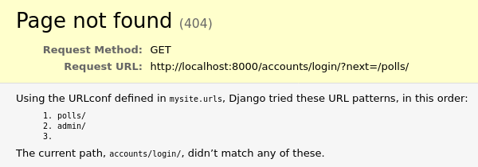
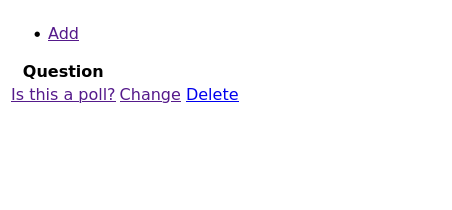
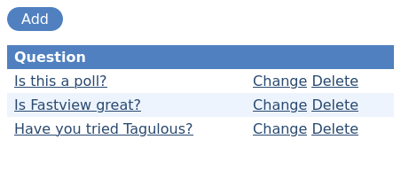

=======================================
Writing your first Fastview app, part 1
=======================================

Install Fastview
================

Install using pip::

    pip install django-fastview

Add to ``settings.INSTALLED_APPS``:

.. code-block:: python
    :caption: mysite/settings.py

    INSTALLED_APPS = [
        ...
        "fastview",
        "polls.apps.PollsConfig",
    ]

We'll also use the default CSS and JavaScript in our project, so lets add them to our
site's base template:

.. code-block:: html+django
    :caption: templates/base_site.html

    <head>
        ...
        <link rel="stylesheet" href="">
        
    
    </head>

Set up a ``ViewGroup``
======================

Fastview uses :doc:`ViewGroups <../viewgroups>` to tie together a collection of related
views. Usually you will want the :ref:`ModelViewGroup <viewgroups.modelviewgroup>`
class, which adds views to operate on a single model.

Lets add one to our views (leave everything else there for now):

.. code-block:: python
    :caption: polls/views.py

    from fastview.viewgroups import ModelViewGroup
    from .models import Question

    class PollViewGroup(ModelViewGroup):
        model = Question

Now we need to put it at an accessible URL. Because a ViewGroup manages multiple views
and urls, it has an ``include`` method which generates its own URLconf. This takes the
same arguments as the regular `include`__ function.

__ https://docs.djangoproject.com/en/3.2/ref/urls/#django.urls.include

Because we want to put our views at ``/polls/``, we'll add it directly to our top-level
urls in ``mysite.urls``.

Remove the existing line with ``include("polls.urls")`` and replace it with a call to
``PollViewGroup.include(..)``:

.. code-block:: python
    :caption: mysite/urls.py

    from django.contrib import admin
    from django.urls import path
    from django.views.generic import RedirectView

    from polls.views import PollViewGroup

    urlpatterns = [
        path("polls/", PollViewGroup().include(namespace="polls")),
        path("admin/", admin.site.urls),
        path("", RedirectView.as_view(pattern_name="polls:index", permanent=False)),
    ]

And now we have a working ``ViewGroup``. Lets see what happens in the browser:

Two problems: we have no public-facing auth system, and we're being denied access to the
ViewGroup.

Make everything public
======================

Lets fix access first. By default, ViewGroups deny access to all their views. This is by
design - we're taking a similar approach to the Django admin site, where you have to opt
users in -  we want to make you think about who you're giving access to which views.

For now, lets just make every view public:

.. code-block:: python
    :caption: polls/views.py

    from fastview import permissions

    class PollViewGroup(ModelViewGroup):
        model = Question
        permission = permissions.Public()

Now try ``/polls/`` again:

This is the index, using a ``ListView``, and it links to the other views in the
ViewGroup. It's not much to look at though, so lets customise the styles.

Add some style
==============

First the action list. These are the list of links at the top of the page - at the
moment our list view only has one link, but our detail view has four. Lets style them as
a row of buttons:

.. note::
    TODO: Move basic layout into fastview.css

.. code-block:: css
    :caption: static/site.css

    /* Fastview action list */
    ul.fastview-actions {
      margin: 0 0 1rem 0;
      padding: 0;
    }

    ul.fastview-actions li {
      display: inline-block;
    }

    ul.fastview-actions a {
      background: #5080c0;
      border-radius: 1rem;
      color: white;
      display: block;
      padding: 0.25rem 1rem;
      text-decoration: none;
    }

    ul.fastview-actions a:hover {
      background: #294970;
    }

And we can style the list view table too:

.. code-block:: css
    :caption: static/site.css

    /* Fastview list table */
    table.fastview-list-table {
      width: 100%;
      border-spacing: 0;
    }

    table.fastview-list-table th,
    table.fastview-list-table td {
      text-align: left;
      vertical-align: top;
      padding: 0.25rem 0.5rem;
    }

    table.fastview-list-table th {
      background: #5080c0;
      color: #fff;
    }

    table.fastview-list-table tr:nth-child(even) {
      background: #edf4fd;
      color: #fff;
    }

Lets try the list view again:

That'll do for our poll index. We can now remove our old ``IndexView`` from
``polls/views.py``.

Fastview makes no assumptions about your design. If you write your own CSS these
elements are easy to style, or if you prefer to use a CSS component framework like
Bootstrap or Tailwind, the templates are designed to be easy to customise - each element
is broken out into a separate sub-template, ready to be overridden or included in a
different parent page structure. You'll see how this works in the next part of the
tutorial.

Now we've covered the basics, lets move on to `part 2 of this tutorial <part2>`_ to see
how to start customising the views in our ViewGroup.
