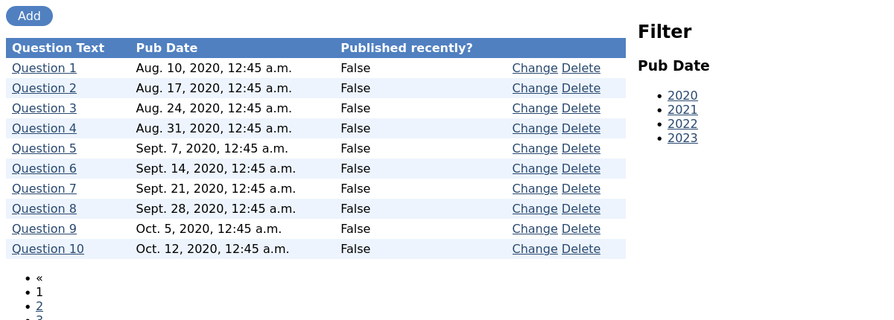
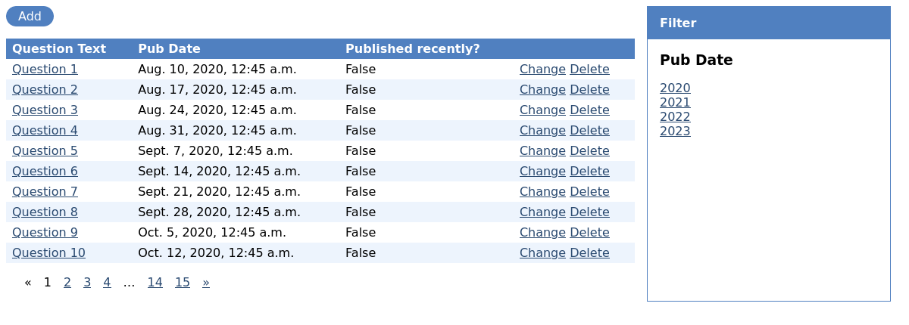

=======================================
Writing your first Fastview app, part 2
=======================================

Digging into the ViewGroup
==========================

Views are added to a ViewGroup by adding a class-based view to the class with a name in
the format ``<action>_view``, where the *action* part of the name is how the viewgroup and
other views will refer to it.

For example, a ViewGroup with ``detail_view = generics.DetailView`` will give it the
action name ``detail``, it can be linked to as ```` etc.

Fastview provides generic class-based views (CBVs) which wrap Django's generic CBVs with
a bit of extra logic for permission handling and other functionality.

The ModelViewGroup defines 5 actions using Fastview's generic views::

    from fastview.viewgroups import ViewGroup
    from fastview.views import generic

    class ModelViewGroup(ViewGroup):
        index_view = generic.ListView
        detail_view = generic.DetailView
        create_view = generic.CreateView
        update_view = generic.UpdateView
        delete_view = generic.DeleteView

This makes it easy to completely change the functionality of these views, or add or
remove them.

Configure the list view
=======================

Fastview's ListView provides a lot more functionality than a standard CBV ListView. At
the moment we're just showing each quiz question - lets show some extra columns and add
some filtering.

Lets add a ``ListView`` and use it for the index view on the ``PollViewGroup``:

.. code-block:: python
    :caption: polls/views.py

    # Remove::
    #   from django.views import generic

    from fastview.views import generic

    class ListView(generic.ListView):
        fields = ["question_text", "pub_date", "was_published_recently"]
        filters = ["pub_date"]
        paginate_by = 25

    class PollViewGroup(ModelViewGroup):
        # ...
        index_view = ListView

Note how we didn't mention the model or template name in our View - it will get the
model from the ViewGroup, and will be using Fastview's default index templates (although
you can override them both).

We've done five things here:

* We've swapped ``django.views.generic`` for ``fastview.views.generic``. These are
  subclasses of Django's, so will be compatible.

* We've added ``paginate_by`` to activate the Django CBV's pagination. Fastview will
  detect this and add a set of pagination links.

* The ``fields`` attribute defines the list of fields to use when displaying each
  object. We're showing a mix of model fields and model methods. You will notice that
  Fastview has picked up the Django admin attributes set on ``was_published_recently``
  by ``@admin.display``.

* The ``filters`` attribute defines the list of filters to present to the user. Again,
  how the filter is shown to the user has a functional default but is easy to override.

* We've replaced the old IndexView overriden the default ``index_view`` with our own CBV.

Lets look at the list view again and see what has changed:

We've now got a new filter panel on the right-hand side, and a list of pagination links
at the bottom. You'll see that the Fastview has detected that ``pub_date`` is a date
field, so it has picked a date-based filter.

Again, Tagulous's default styles has some practical values to make it function, but lets
add some basic styles:

.. note::
    TODO: Move this into fastview.css

.. code-block:: css
    :caption: static/site.css

    /* Fastview list filter (simplified) */
    div.fastview-list-filter {
      margin: 0 1rem;
      padding: 0;
    }

    div.fastview-list-filter ul {
      list-style: none;
      margin: 0;
      padding: 0;
    }

    /* Fastview pagination */
    div.fastview-pagination ul {
      list-style: none;
      margin: 1rem;
      padding: 0;
    }

    div.fastview-pagination li {
      display: inline-block;
      margin: 0 0.5rem;
    }

Configure with a dict
=====================

Creating a view class can be useful if you want to override its methods, but it bloats
your views.py if you just want to customise an attribute or two.

Fastview has a shortcut - instead of setting the view on ``index_view``, lets delete the
``ListView`` we defined and redefine the view with a dict:

.. code-block:: python
    :caption: polls/views.py

    from fastview.views import generic

    class PollViewGroup(ModelViewGroup):
        model = Question
        permission = permissions.Public()
        index_view = {
            "fields": ["question_text", "pub_date", "was_published_recently"],
            "filters": ["pub_date"],
            "paginate_by": 25,
        }

This will configure the view class as if you had subclassed it yourself with those
attributes.

Adding a new view
=================

Our list index is nice and functional now, but it doesn't look that interesting for
users. Lets convert our old ``IndexView`` from the Django tutorial. Originally it was:

.. code-block:: python
    :caption: polls/views.py

    class IndexView(generic.ListView):
        template_name = "polls/index.html"
        context_object_name = "latest_question_list"

        def get_queryset(self):
            """Return the last five published questions."""

            return Question.objects.filter(pub_date__lte=timezone.now()).order_by(
                "-pub_date"
            )[:5]

Lets change it to work more closely with Fastview. Instead of querying the model
directly, we'll call ``super().get_queryset()`` so we can benefit from Fastview's
standard permission checks and filtering. We'll then move our list view and add our
index back in its place:

.. code-block:: python
    :caption: polls/views.py

    class IndexView(generic.ListView):
        template_name = "polls/index.html"
        context_annotated_name = "latest_question_list"

        def get_queryset(self):
            """Return the last five published questions."""

            qs = super().get_queryset()
            return qs.filter(pub_date__lte=timezone.now()).order_by(
                "-pub_date"
            )[:5]

    class PollViewGroup(ModelViewGroup):
        # ...
        index_view = IndexView
        list_view = generic.ListView.config(
            fields=["question_text", "pub_date", "was_published_recently"],
            filters=["pub_date"],
            paginate_by=25,
        )

You'll see we have also replaced the dict view configuration with a call to
``ListView.config(..)``. The dict is actually a shortcut to calling ``.config(...)`` on
a Fastview generic view, so you can define and customise new views on the fly without
the need to explicitly subclass it yourself.

We also changed ``context_object_name`` to ``context_annotated_name`` - we'll come
back to that when we write the template.

Custom ListView Template
========================

A Fastview ``ListView`` provides the same context to a template that a Django
``ListView`` does, but it also adds several variables for Fastview to do its work.

The main addition is an annotated object list (``annotated_object_list`` by default,
controlled by the ``context_annotated_name`` property), which wraps each object so you
can iterate over the values in the order set by ``fields``, with additional attributes
for action permission checks and URLs to related views.

You can take a look at the :gitref:`default list template
<fastview/templates/fragments/list.html>` to see how to iterate over the fields, but
we want something more designed, so we'll use the annotated objects for permission
checks, and then access the original object directly:

.. code-block:: django-html
    :caption: polls/templates/index.html

    

    

    
      {# We'll iterate over the annotated object list #}
      
        

          {# Access the Question instance as annotated_question.object #}
          
            <h2>{{ question.question_text }}</h2>
            
{{ question.pub_date|date:"D d M Y" }}

          

          {# Use the permission annotations to check access #}
          
            <a href="{{ annotation.get_vote_url }}">Vote</A>
          
            <a href="{{ annotation.get_detail_url }}">See the question</a>
          
        

      
      </ul>
    
        
No polls are available.

    

    

Every view defined in the viewgroup which operates on an object gets its own ``can_X``
permission check, and ``get_X_url`` to return the URL to the view.

Here we call ``get_detail_url``, which links to the detail view, but we also check the
``can_vote`` and call ``get_vote_url``, for a view which doesn't exist yet. We'll add
that and the other views in `part3`_.

Going further
-------------

This covers the basics of working with the ``ListView`` and its options, but for a
deeper dive into the functionality available and how to customise the defaults, you may
like to look at:

* :doc:`listview`
* :ref:`filters__custom_filter_method`
* :doc:`generic_views/annotated`

When you're ready, lets move on to `part 3 of this tutorial <part3>`_ where we'll add
the missing views and see how to work with forms and inlines.
